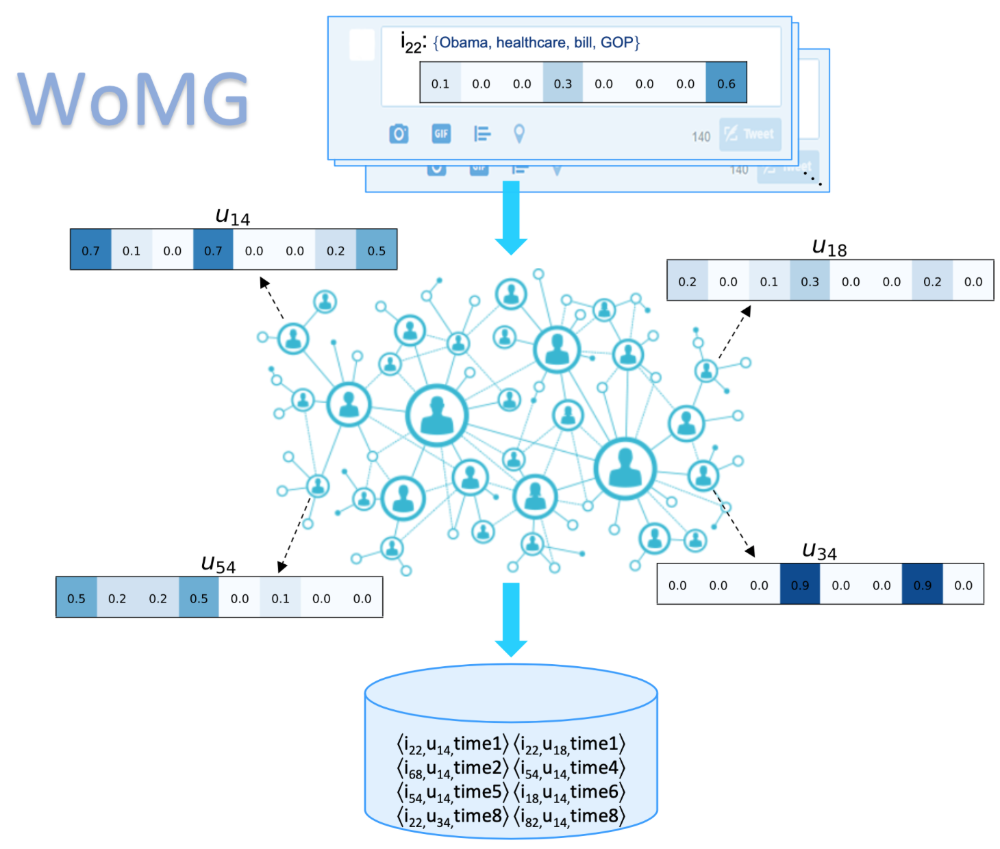

# WoMG: Word of Mouth Generator
*WoMG* is a Python library for **Word-of-Mouth** Cascades **Generation**.

WoMG is a syntectic data generator which combines  topic  modeling  and  a  topic-aware  propagation model  to  create  realistic  information-rich  cascades,  whose shape depends on many factors, including the topic of theitem and its virality,  the homophily of the social network, the interests of its users and their social influence.

This repository provides a reference implementation of *WoMG* as described in:<br>
> WoMG: a Library for Word-of-Mouth Cascades Generation.<br>
> Federico Cinus, Francesco Bonchi, Corrado Monti, André Panisson.<br>
> <Insert paper link>
and: <br>
> Generating realistic interest-driven information cascades.<br>
> Federico Cinus, Francesco Bonchi, Corrado Monti, André Panisson.<br>
> <Insert paper link>

*WoMG* generates synthetic datasets of documents cascades on network.
It starts with any (un)directed, (un)weighted graph and a collection of documents and it outputs the propagation DAGs (Directed-Acyclic graph) of the documents through the network.




## Installation
Install using ``pip``: <br>

```bash
$ pip install womg
```

You can also download or clone the GitHub repository: <br>

```bash
$ git clone https://github.com/FedericoCinus/WoMG.git
```


## Quickstart
The WoMG package provides a Python module and a command-line method. To import the womg function type:<br/>

```python
from womg import womg
```
The **demo.ipynb** provides a tutorial.


#### Options
You can check out the other options available to use with *WoMG* using:<br/>

```python
?womg
```

#### Input
[Network] The supported input format are: NetworkX instance and edgelist (txt extension):

		node1_id_int node2_id_int <weight_float, optional>

You can specify the edgelist path using the *graph* argument:

```bash
womg(graph='/this/is/an/example/path/Graph_Folder/edgelist.txt')
```

#### Output (default)
1. [Propagations] The output format is:

		time; item; node
2. [Items descriptions] :

		item; [topic-dim vector]

3. [Topic descriptions] :

		(topic_index, linear combination of words)

All outputs are returned by the **womg** function and saved in the current directory.

You can also specify the output folder path:

```python
womg(path_out='/this/is/an/example/path/Output_Folder')
```


-----------------------------------------------------------------------------------------------


### Options

0. ``topics`` number of topics to be considered in the topic distributions of documents and nodes interests; it has to be less than number of dimensions of the nodes' space provided by node2vec
##### Graph
1. ``homophily`` H degree of homophily. Node2vec is used as baseline for generating interests vectors of the nodes starting from the given graph. Parameters *p* and *q* can achieve different decoded degree of homophily and structural equivalence (see paper). The best mix of them can be achieved only by a deep analysis of the network and a grid searh on the parameters. In order to pursuit generality in the input graph we use three degree of mixing: structural equivalence predominant, deepWalk (p=1, q=1), homophily predominant (which are not the best for representing the graph!).  1-H is the degree of social influence between nodes; which is the percentage of the avg interests vecs norms to be assigned to the influence vectors.

##### Documents
2. ``docs`` number of documents TO BE GENERATED by lda, giving this parameter lda will be directly set to generative mode
3.  ``virality`` virality of the doc; if virality is high, exponent of the power law is high and threshold for activation is low.

##### Diffusion
4.  ``steps`` steps of the diffusion simulation
5.  ``actives`` percentage of active nodes with respect to the total number of nodes in the intial configuration (before diffusion) for each doc.

##### Node2Vec
6.	``dimensions``        Number of dimensions for node2vec. Default 128
7.	``walk-length``       length of walk per source. Default 80
8.	``num-walks``       number of walks per source. Default 10
9.	``window-size``      context size for optimization. Default 10
10.	``iter``           number of epochs in SGD
11.	``workers``     number of parallel workers. Default 8
12.	``p``                manually set BFS parameter; else: it is set by H
13.	``q``                 manually set DFS parameter; else: it is set by H

##### Input and Output
14.	``graph``       Input path of the graph edgelist
15.	``weighted``            boolean specifying (un)weighted. Default unweighted
16.	``unweighted``
17.	``directed``            graph is (un)directed. Default undirected
18.	``undirected``
19.	``docs-folder``  Input path of the documents folder
20.	``output``       Outputs path
21.	``format``       Outputs format

22.	``seed``         Seed (int) for random distribution extraction


### Citing


	@inproceedings{,
	author = {},
	 title = {},
	 booktitle = {Proceedings},
	 year = {2020}
	}


### Miscellaneous

Please feel free ..

*Note:* This is only a reference implementation analysis and more details are provided by the thesis.
