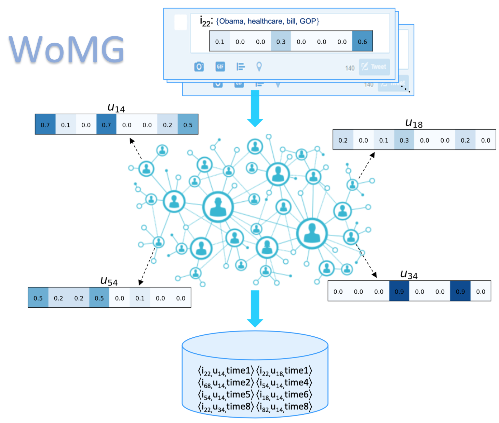

# WoMG: Word of Mouth Generator

*WoMG* is a Python library for **Word-of-Mouth** Cascades **Generation** which combines  topic  modeling  and  a  topic-aware  propagation model  to  create  realistic  information-rich  cascades,  whose shape depends on many factors, including the topic of theitem and its virality,  the homophily of the social network, the interests of its users and their social influence.

*WoMG* starts with any (un)directed, (un)weighted graph and a collection of documents, generates interests of each node, extracts the topic distribution of each document, and finally outputs the propagation DAGs (Directed-Acyclic graph) of the documents through the network.




## Installation

### Dependencies
- click==7.1.2
- decorator==4.4.2
- joblib==1.0.1
- networkx==2.5
- numpy==1.19.5
- scikit-learn==0.24.1
- scipy==1.5.4
- tqdm==4.56.2
- gensim==3.8.3

### User installation
Install using ``pip``: <br>

```bash
$ pip install womg
```

#### Source code
```bash
$ git clone https://github.com/FedericoCinus/WoMG.git
```


## Usage
The WoMG package provides a Python module and a command-line executable.<br/>
1.
```python
from womg import womg
import networkx as nx

N = 100
graph = nx.random_geometric_graph(N, .2)
docs_path = '/this/is/an/example/documents_folder/'

prop = womg(graph=graph, docs_path=docs_path)

prop.propagations[0] # [(time, node)]
```
>> [(0,0), (0,2), (1,5) .. ]

2.
```bash
$ womg --docs_folder 'example/documents_folder/' --graph 'example/graph_folder/graph_edgelist.txt'

```

The [demo notebook](https://github.com/FedericoCinus/WoMG/blob/master/demo.ipynb)  provides a tutorial.


#### Options
You can check out the other options available to use with *WoMG* from jupyter notebook using:<br/>

```python
?womg
```

or in the command-line typing:
```bash
$ womg --help
```

``numb_topics`` defines the dimension of topic space where documents and nodes are described <br />
``homophily`` modifies the interests similarity between connected nodes <br />
``gn_strength`` modifies the strength of influence exerted on each node at the initial time step <br />
``infl_strength``  increments the strength of influence exerted on each node with the interests of <br />
``virality_resistance`` determines the global resistance to propagation of the documents <br />


## Authors
This repository provides a reference implementation of *WoMG* as described in:<br>

> WoMG: a Library for Word-of-Mouth Cascades Generation.<br>
> Federico Cinus, Francesco Bonchi, Corrado Monti, André Panisson.<br>
> <https://dl.acm.org/doi/abs/10.1145/3437963.3441693>
	
	
> Generating realistic interest-driven information cascades.<br>
> Federico Cinus, Francesco Bonchi, Corrado Monti, André Panisson.<br>
> <https://ojs.aaai.org//index.php/ICWSM/article/view/7283>

## Citation
@inproceedings{cinus2020generating,
  title={Generating Realistic Interest-Driven Information Cascades},
  author={Cinus, Federico and Bonchi, Francesco and Monti, Corrado and Panisson, Andr{\'e}},
  booktitle={Proceedings of the International AAAI Conference on Web and Social Media},
  volume={14},
  pages={107--118},
  year={2020}
}


@inproceedings{cinus2021womg,
  title={WoMG: A Library for Word-of-Mouth Cascades Generation},
  author={Cinus, Federico and Bonchi, Francesco and Monti, Corrado and Panisson, Andr{\'e}},
  booktitle={Proceedings of the 14th ACM International Conference on Web Search and Data Mining},
  pages={1065--1068},
  year={2021}
}
